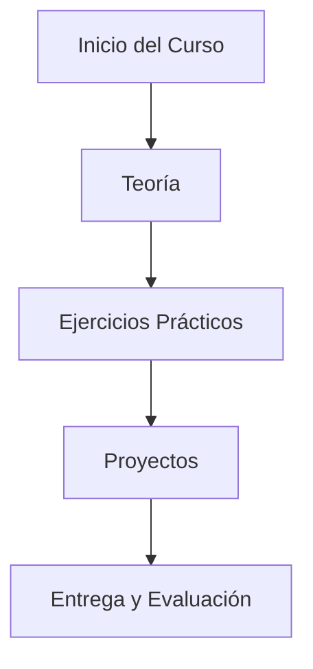
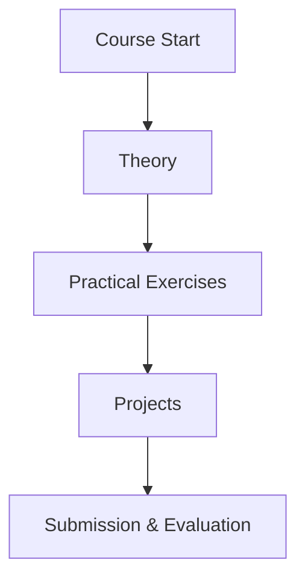

# Full Stack Course

Este repositorio contiene los ejercicios realizados por JuMad-SE (Juan David Madrid), estudiante y entusiasta del desarrollo de software, como parte del curso Full Stack de la Universidad de Helsinki.

## Sobre el autor

- GitHub: [JuMad-SE](https://github.com/JuMad-SE)
- Apasionado por la programación, el aprendizaje continuo y la resolución de problemas complejos.
- Interesado en tecnologías web, backend y buenas prácticas de desarrollo.

## Descripción

Aquí encontrarás soluciones, ejemplos y proyectos desarrollados durante el curso, abarcando temas como React, Node.js, bases de datos, testing y despliegue de aplicaciones modernas.

---

## 📊 Diagrama del Proyecto (Mermaid)

## 📊 Project Diagram (Mermaid)

modificado con MCP