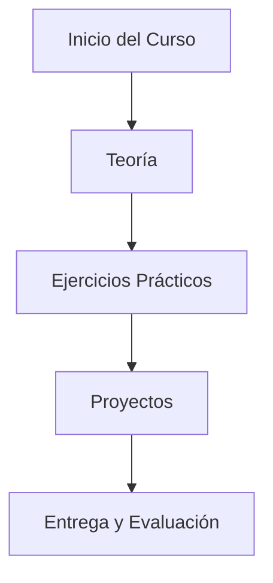

# Conversación con Gemini

Esta es una conversación con el asistente de IA de Google, Gemini.

## Solicitud del Usuario

El usuario solicitó la siguiente información:

1.  Buscar en GitHub al usuario "JuMad-SE".
2.  Entrar a su repositorio "helsinki-fullstack-course".
3.  Mostrar toda la información relevante en un formato agradable.

## Respuesta de Gemini

Gemini respondió con la siguiente información:

### **Repositorio: helsinki-fullstack-course**

*   **Propietario:** [JuMad-SE](https://github.com/JuMad-SE)
*   **Descripción:** Un repositorio que contiene los ejercicios del curso Full Stack ofrecido por la Universidad de Helsinki.
*   **URL del Repositorio:** [helsinki-fullstack-course](https://github.com/JuMad-SE/helsinki-fullstack-course)

---

### **Contenido del README.md**

#### **Sobre el autor**

*   **GitHub:** [JuMad-SE](https://github.com/JuMad-SE) (Juan David Madrid)
*   Apasionado por la programación, el aprendizaje continuo y la resolución de problemas complejos.
*   Interesado en tecnologías web, backend y buenas prácticas de desarrollo.

#### **Descripción del Repositorio**

En este repositorio encontrarás soluciones, ejemplos y proyectos desarrollados durante el curso, abarcando temas como React, Node.js, bases de datos, testing y despliegue de aplicaciones modernas.

---

#### **Diagrama del Proyecto (Mermaid)**

