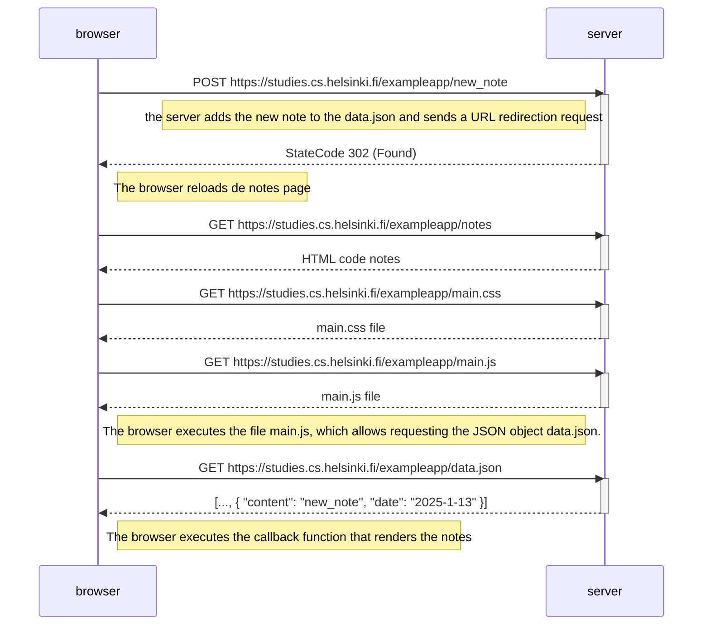

```mermaid
sequenceDiagram
    participant browser
    participant server

    browser->>server: POST https://studies.cs.helsinki.fi/exampleapp/new_note
    activate server

    Note left of server: the server adds the new note to the data.json and sends a URL redirection request
    server-->>browser: StateCode 302 (Found)
    deactivate server
    
    Note right of browser: The browser reloads de notes page
    browser->>server: GET https://studies.cs.helsinki.fi/exampleapp/notes
    activate server
    server-->>browser: HTML code notes
    deactivate server

    browser->>server: GET https://studies.cs.helsinki.fi/exampleapp/main.css
    activate server
    server-->>browser: main.css file
    deactivate server

    browser->>server: GET https://studies.cs.helsinki.fi/exampleapp/main.js
    activate server
    server-->>browser: main.js file
    deactivate server

    Note right of browser: The browser executes the file main.js, which allows requesting the JSON object data.json.

    browser->>server: GET https://studies.cs.helsinki.fi/exampleapp/data.json
    activate server
    server-->>browser: [..., { "content": "new_note", "date": "2025-1-13" }]
    deactivate server

    Note right of browser: The browser executes the callback function that renders the notes
```
