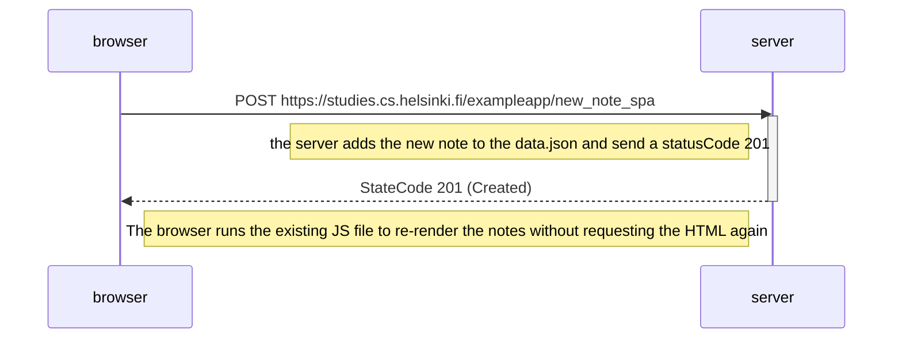

```mermaid
sequenceDiagram
    participant browser
    participant server

    browser->>server: POST https://studies.cs.helsinki.fi/exampleapp/new_note_spa
    activate server

    Note left of server: the server adds the new note to the data.json and send a statusCode 201
    server-->>browser: StateCode 201 (Created)
    deactivate server
    
    Note right of browser: The browser runs the existing JS file to re-render the notes without requesting the HTML again

```
